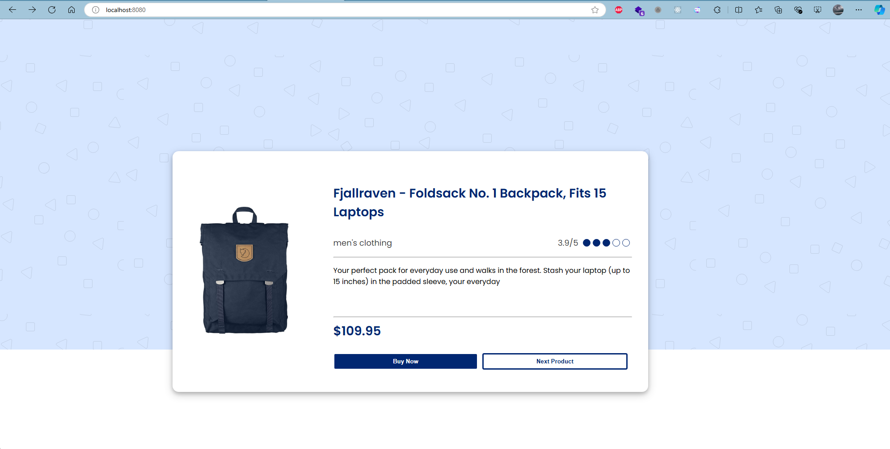
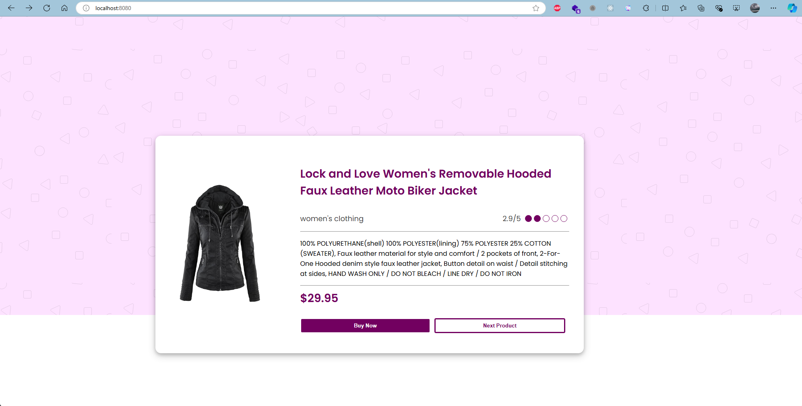
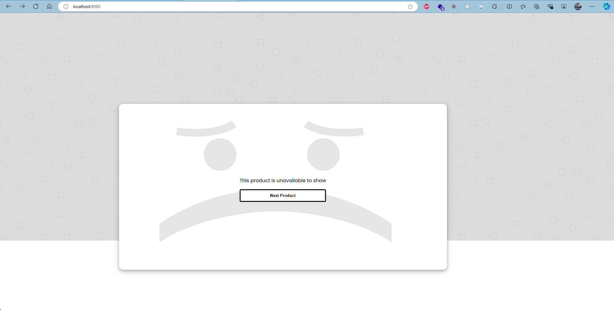

# E-Commerce Catalog

## Description:

This project is part of the VIX Front End Core Initiative and involves collaboration between the backend and ui/ux teams. This project aims to create a user interface for an e-commerce website that displays items from the men's and women's categories.

## Features

1. **API Data**: Fetching the data from the backend using [Fake Store API](https://fakestoreapi.com/) to display products.

   - Example URL: `https://fakestoreapi.com/products`

2. **Card**: Product displayed are shown using card, based on the design from Figma.

3. **Navigation**: Users can navigate to the next product by clicking the "Next Product" button.

4. **Spinner**: While waiting for the product to be displayed, the spinner is shown until the product is successfully shown.

5. **Category**: Based on the design from Figma, there's three categories. Below are the categories and example of the UI.
   - Men's Clothing:
     
   - Women's Clothing:
     
   - Product Unavailable:
     
